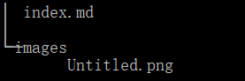

# 图片显示

大多写 .md 文件的习惯是将图片放在同级目录下的文件夹中，这样的方式在使用Markdown相关软件\插件进行预览时不会出现问题。但是在Hugo编译后，图片无法正常显示。

根据其他博客的内容，Hugo在编译时会将 **\static** 文件夹下面的所有目录和文件搬到 **\public** 下。我尝试了一下的解决方法：

1. 在 .md 文件中，索引的路径以 \static 目录为根目录。例如图片文件存储的存储路径为 \static\images\1.png, 则 .md 文件中的索引路径为 \images\1.png即可。这种方法并没有什么卵用。。。。，没有效果
2. 其他的方法我就不一一列举了。

最终的解决方案是在 \content\post 下建立文件夹，文件夹的名称即为原 .md 文件的名称，原 .md 文件的内容放在该新建文件夹下的 [index.md](http://index.md) 文件中，index.md 文件中引用的图片放在新建文件夹下的文件夹中。文件目录如下：

# Netlify的主题问题

使用Hugo + Netlify 时，主题的下载需要使用 `git submodule add   <theme-address>` 的命令，否则预览时看不到使用的主题。
