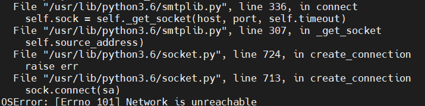
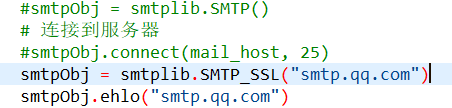

## 报错

## 解决

主要问题似乎是因为Linux下对发送的加密更加严格
使用SSL链接即可，如下图所示：

参考链接如下：

1. [关于python smtplib在linux上发送邮件失败解决办法](https://www.jianshu.com/p/fc55404b6db7)

2. [python smtplib在linux上发送邮件失败解决方式](https://cloud.tencent.com/developer/article/1655485)

3. [Python SMTP Errno 10060](https://stackoverflow.com/questions/6979678/python-smtp-errno-10060)