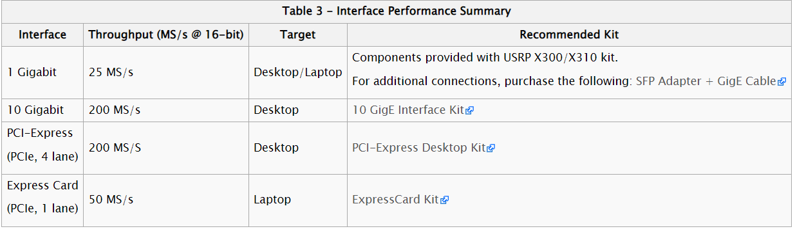
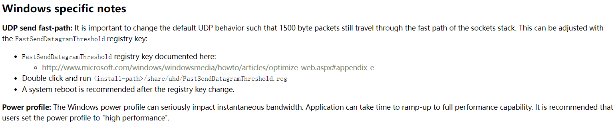
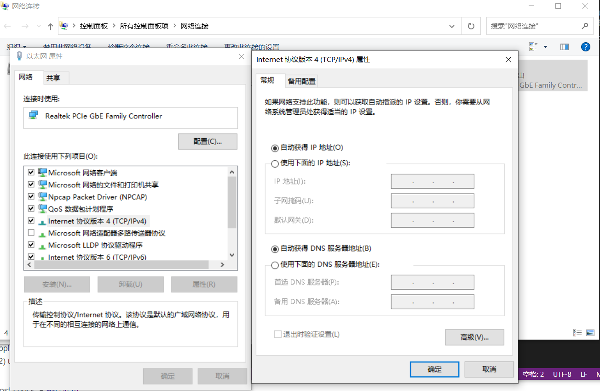

## 写在前面

在刚上手USRP的时候走了比较多的弯路，当时google了很多，也很难找到准确的解决方法，因此写这篇博客的目的主要是记录一下使用USRP X310的过程中才到的一些坑，一来避免自己再犯此类的错误，二来也可以供其他人查阅。

## 硬件配置和环境搭建

先说明一下硬件配置和使用的工具：

1. 硬件：Ettus USRP X310 + UBX 160 v2 +10G Ethernet

2. 软件：Matlab USRP toolbox  

## 踩坑总结

### 设备的坑

在购买设备（Enthernet）的时候就遇到了问题，Ettus附赠的光口转电口模块和网线只能支持1G的速率，如果想用10G Ethnernet的话需要重新购买对应的光转电模块和网线。另外需要注意的是，淘宝上是可以买到自带SPF的光缆的，我买来试过了，插上USRP和网卡以后，PC不能识别到USRP，基本的ping通都做不到，不知道是我配置的问题还是硬件的问题。目前我这里只能使用10G的光转电模块+超7类网线。在这里贴一下Ettus官网对设备参数的介绍吧。[图片地址](https://kb.ettus.com/X300/X310)

### 网络配置的坑

由于使用以太网进行通信，因此需要对系统的相关参数进行配置。主要需要配置**静态地址**，**UDP广播**,**防火墙**,**MTU**,**FastSendDatagramThreshold**。这里主要说明一下Windows系统下的配置方法，Linux系统下的配置方法在Ettus官网上有，这里附上[链接](https://files.ettus.com/manual/page_usrp_x3x0_config.html#x3x0cfg_hostpc_netcfg_ip)

#### 1.设置FastSendDatagramThreshold

这个参数主要设置的UDP传输包的大小

#### 2.设置MTU

这个可以通过相关命令进行设置，或者在**设备管理器**右键你的万兆网卡，在属性中将**Jumbo frame**设置为9000

#### 3.设置防火墙Firewall

设置防火墙的目的是避免windows系统拦截你的UDP包（Windows上位机查找设备的原理是UDP广播），因此需要在防火墙中新建入站规则，允许UDP端口49152。

#### 4.设置静态地址

在网络适配器中设置与USRP对应的IP地址，如下图所示。

### 编程方面的坑

本人使用Matlab版本为R2019b，UHD版本多个。

#### 1.关于UHD

首先UHD版本与USRP中烧录的系统是需要对应的，可以在命令行界面通过**uhd_usrp_probe**命令或在Matlab命令行中通过**probesdru**命令查看版本兼容的信息（如果不兼容，需要按照提示烧录对应镜像，matlab烧录的命令是**sdruload**）。

#### 2.关于程序逻辑的问题

所谓的程序逻辑就是如果控制USRP x310进行数据的收发，在matlab的usrp toolbox中，qpsk例程提供了Simulink Model和Script两种形式。**需要注意的是**，Simulink Model是可以在单台USRP上同时进行收发的，但是Script不可以，会显示**devcie not responding**的错误。

#### 3.关于Overrun与Underrun的问题

在前面的网络配置中，如果配置不恰当，就会出现Underrun和Overrun的问题，

* Overrun:出现在接收端，PC接收的的速度慢于USRP向PC发送的速度，导致数据丢失。
* Underrun:出现在发送端，PC发送的速度慢于USRP向外发送数据的速度，导致USRP数据empty的情况。

对于Overrun和Underru，官方的说法是可以使用Busrt Mode，但是事实是我在发送端使用Burst Mode会报错，显示**Underflow**的错误，不知道是我那里理解错了还是怎么的，对此有了解的读者可以通过邮箱联系我:)

## 先写到这，暂时就记得这么多，后续想起来再在这里补充
