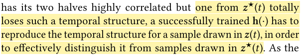

# MoVi-Fi: Motion-robust Vital Signs Waveform Recovery via Deep Interpreted RF Sensing

Data: August 16, 2021

# 术语

1. IR-UWB
2. FMCW
3. RF Channel Impulse Responses (CIRs)
4. a source separation algorithm : **independent component analysis (ICA)**
5. deep neutral  network: **multilayer perceptron (MLP)**

# 笔记

1. **Inspiration**

    > What inspires our design is that RF reflections caused by vital signs, albeit weak, do not totally disappear but are composited with other motion-incurred reflections in a nonlinear manner.

2. innovative method: **deep contrastive learning**
3. authors categorize body movements to three types, and use algorithms to exploit the distinct patterns of various movements types.

    > we propose two novel self-supervised contrastive-learning algorithms to exploit the distinct patterns of various movement types

4. an encoder-decoder module is trained to reproduce the fine-grained waveform of both heartbeat and breath

    > Finally, we design an encoder-decoder module trained by a discriminator, in order to reproduce the fine-grained waveform of both heartbeat and breath.

5. **key idea to detect distance variation in Equ.(1)**

    > The key idea to detect above distance variations with RF signals is to extract the amplitude and phase changes of CIR.

6. authors assume that there is no other objects block the subject. However, this problem widely happen in daily life. 

    > Though there could be multiple reflection paths, radar-based RF-sensing considers only the direct path provided that no other objects block the subject

7. body movements may cause the rate of heartbeat increase such as strenuous exercise. This assumption is incorrect. 

    > they may have different features, such as distinct frequencies, phases, and/or different level of randomness

8. **key approach of separation**

    > it essentially lever-ages the nonlinear mapping ability of a neural feature ex-tractor to reverse the nonlinear composition between body movements and vital signs.

# 问题

1. why reproduce the temporal structure for the sample drawn in $z(x)$? The temporal structure of  bottom half of  $z^{*}(x)$  is heavily corrupted.

    > its temporal structure is heavily corrupted in the bottom half (the lower-right part of the input in Figure 9)

    

---

# 总结