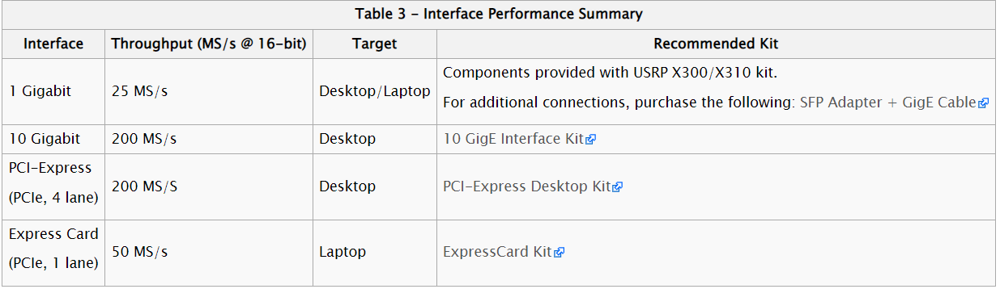

## 写在前面

在刚上手USRP的时候走了比较多的弯路，当时google了很多，也很难找到准确的解决方法，因此写这篇博客的目的主要是记录一下使用USRP X310的过程中才到的一些坑，一来避免自己再犯此类的错误，二来也可以供其他人查阅。

## 硬件配置和环境搭建

先说明一下硬件配置和使用的工具：

1. 硬件：Ettus USRP X310 + UBX 160 v2 +10G Ethernet

2. 软件：Matlab USRP toolbox  

## 踩坑总结

### 设备的坑

在购买设备（Enthernet）的时候就遇到了问题，Ettus附赠的光口转电口模块和网线只能支持1G的速率，如果想用10G Ethnernet的话需要重新购买对应的光转电模块和网线。另外需要注意的是，淘宝上是可以买到自带SPF的光缆的，我买来试过了，插上USRP和网卡以后，PC不能识别到USRP，基本的ping通都做不到，不知道是我配置的问题还是硬件的问题。目前我这里只能使用10G的光转电模块+超7类网线。在这里贴一下Ettus官网对设备参数的介绍吧。[图片地址](https://kb.ettus.com/X300/X310)

