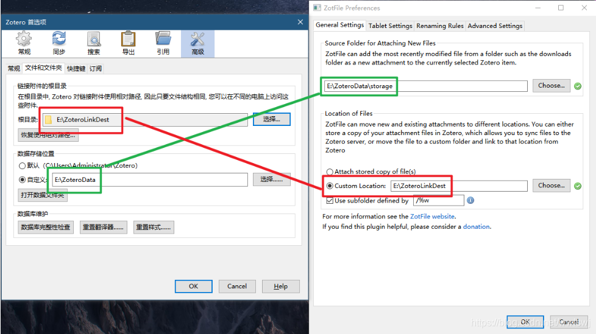

## zotero 文件种类

1. 链接文件
如果一个文件以链接的形式添加到题录中，则文件的链接会保存在Zotero中，而被链接的文件存在于链接文件夹中（该文件夹可以设置，可以通过编辑→首选项→高级→文件和文件夹→"链接附录的根目录"设置）

2. 实体文件
存储在数据目录下/storage文件夹的中的文件

3. 数据
数据只能通过Zotero同步，无法设置相关的文件夹

## 同步方法

详见文后链接,最主要是这个图片

## reference

1. https://blog.csdn.net/wwlswj/article/details/113416164